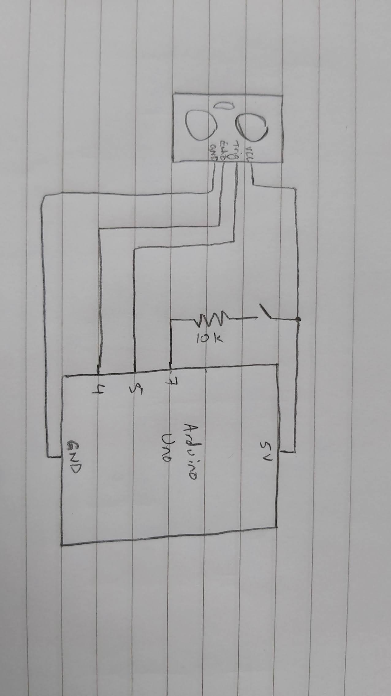
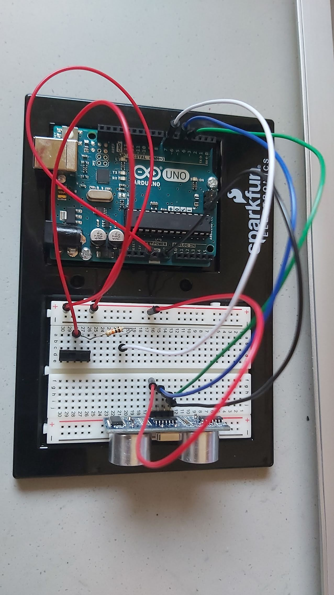

## Game with Arduino and Processing

This is a pacman game but with sensors as the controls. The UV distance sensor is used to determine the position of the pacman on the screen and the toggle switch determines the axis of movement (whether it's vertical or horizontal).

### **Schematic:**

### **Picture:**

[Here](https://youtu.be/_svF1VsiJsA) is a link to the video demonstration

### **Difficulties:**
- For some reason the input from the toggle switch takes some time to change from 1 to 0. Adding a resistor did help a little, but there's still some lag.
- I have yet to figure out how to change the position of the mouth according to the direction of movement. I tried comparing the current sensor value with the previous one but since sensor values jump around so much this just gave a very glitchy effect.
