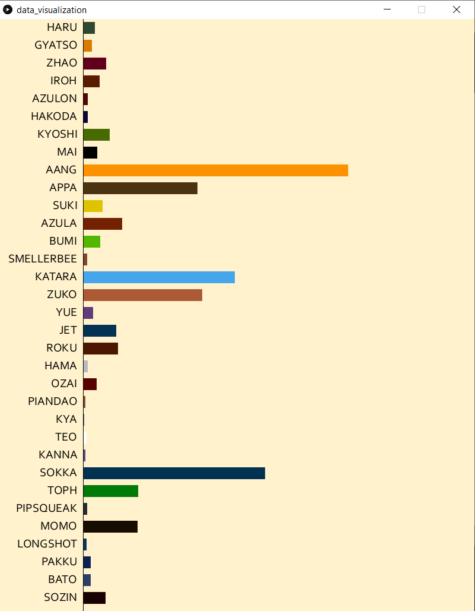

## Data visualization with Processing Assignment

**Screenshot:** 

- The data is taken from the avatar.csv file which can be found [here](https://www.kaggle.com/ekrembayar/avatar-the-last-air-bender).
- The second file (characters.csv) was created by me.
- [Paletton](https://paletton.com/) was used for colors.
- My project lists down the names randomly along with a bar graph of how many times that name is spoken throughout the Avatar: The Last Airbender series.
- I initially wanted to create a word cloud with the size of the words mapped to how often it is spoken, but I couldn't quite figure out how to do that.
- The hardest part was comparing the dialogue words in such a way that even if a name has a special character in front like a comma(,) or an exclamation mark(!), it will still be counted. I accomplished this by comparing only those first letters of the word that correspond to the length of the word.
- At first, I was comparing every word with every name individually in different loops, but obviously that was really time consuming and inefficient. I then came up with the technique that compares each word with every name that is stored in an array. This shortened the length of the code significantly.
- I might add more features to the program later on (interactivity, etc.), but as of the submission time my program output looks like the screenshot above.
