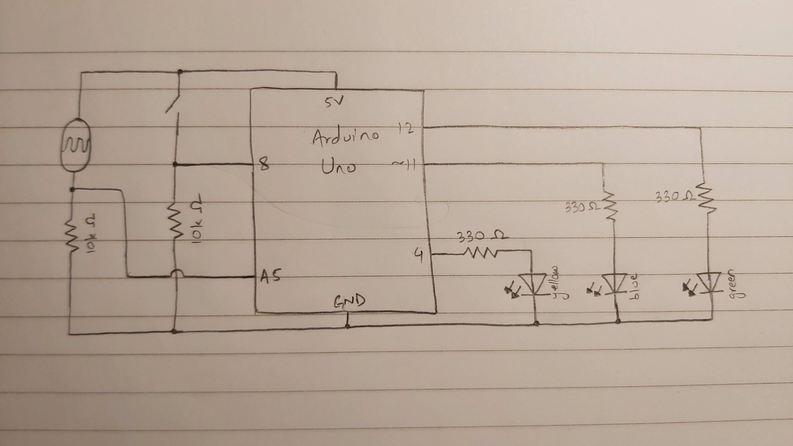

## Digital and Analog Assignment with Arduino

This project is basically getting a digital output using an analog input and an analog output using a digital input. The value of the photoresistor determines the rate of the blinking of the yellow LED. The more light there is, the slower the blinking. On the other hand, how much the switch is pressed determines how bright the blue LED will be. If the photoresistor reading (which is mapped to a 0 to 255 scale) is equal or almost equal to the brightness level of the blue LED, then the green LED lights up to indicate a match.

### **Schematic:**


### **Picture:**


[Here](https://youtu.be/1GvY0D0876A) is a link to the video of the working project.

### **Comments:**
- I was initially using the delay function to make the LED blink but that meant that the value from the switch was being taken at longer intervals so it took really long for the brightness to increase. I solved this by creating a variable keep count of the number of iterations after every state change of the LED. Whenever the count becomes equal to (or greater than) the sensor value, the state is changed and count is restarted.
- I used ````delay(10)```` to give some room for the switch values to be read at a more human pace.
- In the sensor and brightness values comparison I used a margin of 10 on both sides so that the green LED doesn't flicker due to the slight changes in the photoresistor readings.
- In my initial plan I was going to use a button to reset the blue LED's brightness but then realized that the reset button on the Arduino board can perform the same function.
