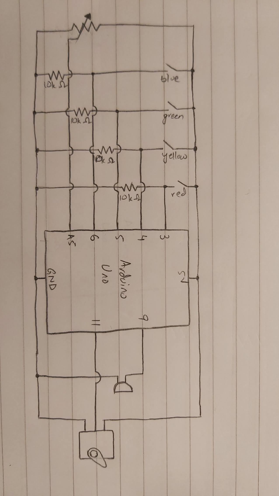
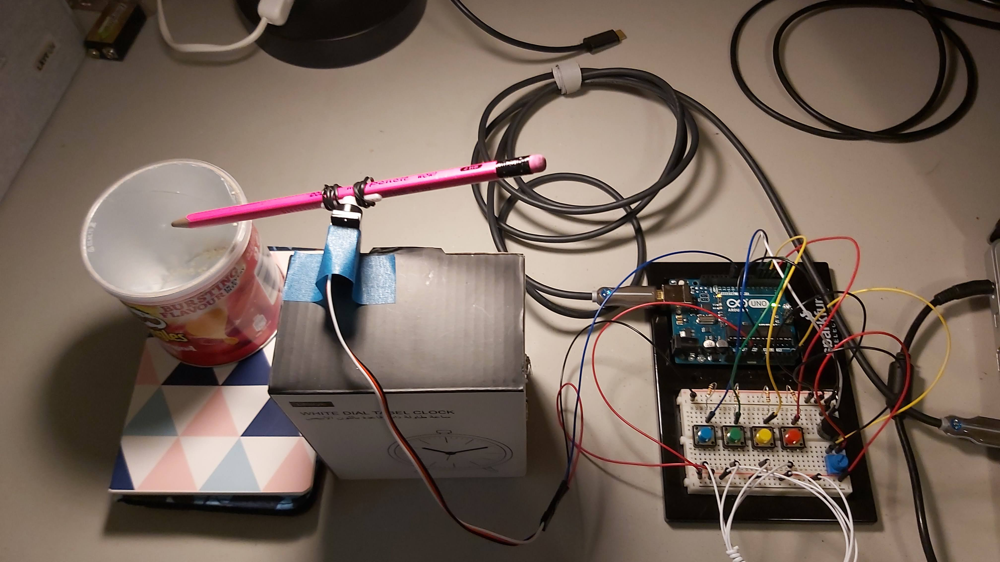
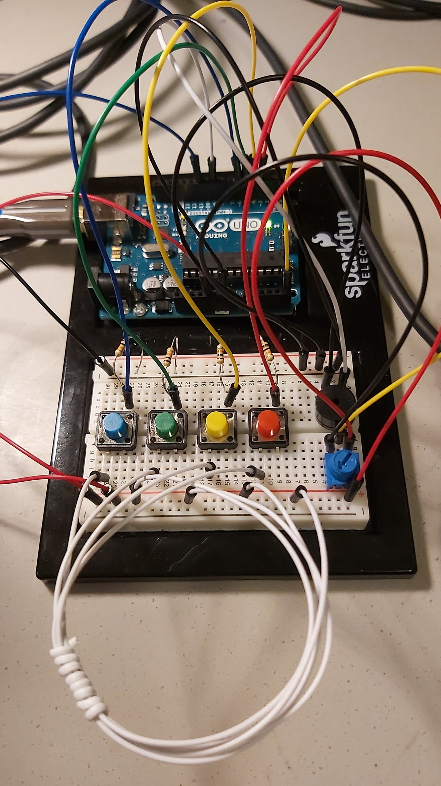

## Musical Instrument with Arduino

For this project I assigned four different notes (NOTE_E3, NOTE_B3, NOTE_CS3, NOTE_A3) to four buttons (red, yellow, green, blue respectively). Therefore, the tone is played on the press of the button. The duration of the tone is determined by the value of the potentiometer. I also added "drums" to this ensemble by tying a pencil to a servo motor and having it hit an empty pringles box. The servo moves between angles 15 and 30. The frequency of the drum is also tied to the potentiometer value.

### **Schematic:**

### **Pictures:**

 is a link to a video of the working project.

### **Difficulties:**
- I did not face any significant problems in this project.
- At first I kept getting a board error when trying to upload despite having selected the correct board as well as the port. Closing and reopening Arduino fixed this.
- The amount of wires on the breadboard were really getting in the way of playing the "instrument". I got around this by tying some of the together.
- I added the condition of running the program only when the potentiometer is not at 0 when I ran into the problem of a never-ending tone.
- It took some time to figure out how to use the servo without using delay. I decided to use the same cnt variable that was keeping track of the loop iterations to reset the servo angle after a particular number of loops (taking 15ms for every angle). 
