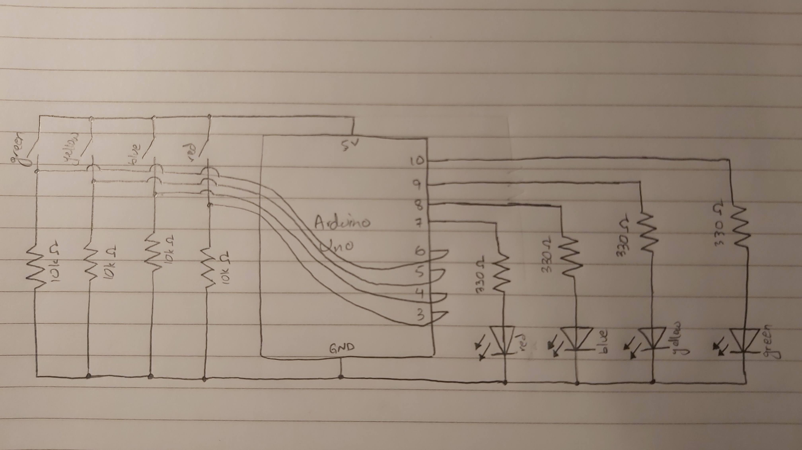
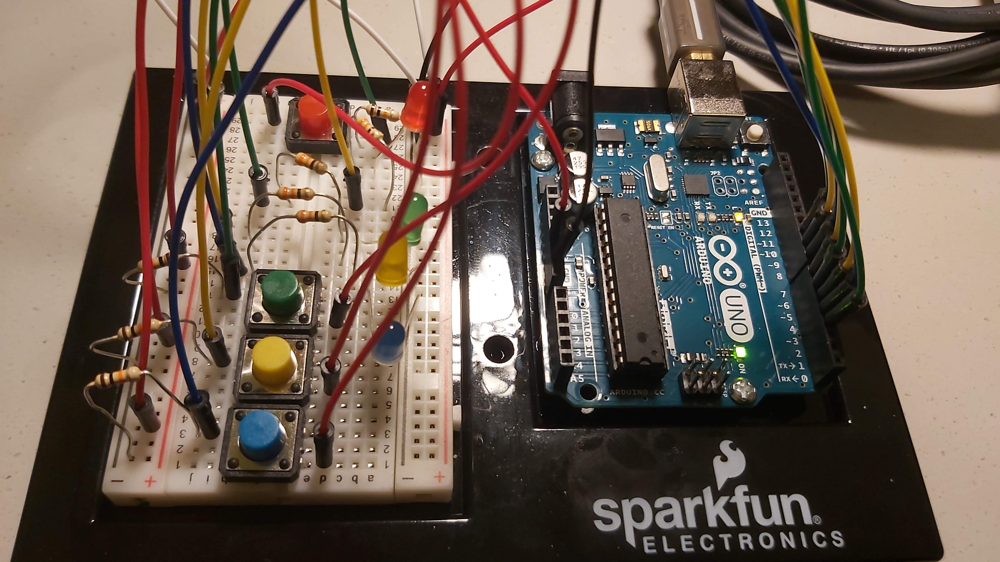

## LED Puzzle Assignment with Arduino

This is a memory game. In each successive level, the number of LEDs in the sequence increases by 1. After the entire sequence has been displayed, the player must press the corresponding buttons in the same sequence to move on to the next level. Getting a button wrong or pressing multiple buttons simultaneously will result in losing the game. This is signalled by the red LED. Pressing the red button (only when the red LED is on), restarts the game.

### **Schematic:**

### **Picture:**

[Here](https://youtu.be/Gd0upyBDh3w) is a link to the video of the working puzzle.

### **Difficulties:**
- For a long time, my program was not giving the desired output. It would either not register that the button pressed was incorrect or fail even when the correct button was pressed.
- Moving the declaration of the sequence array from inside the first if condition to out of the loop() solved this problem.
- Then, there was also the problem that it was reading a single button push as multiple.
- Not considering a button push unless neither of the buttons were pushed on the last iteration fixed this problem.
- The random pattern generation and restarting of the game were the two features working perfectly from the first moment.
