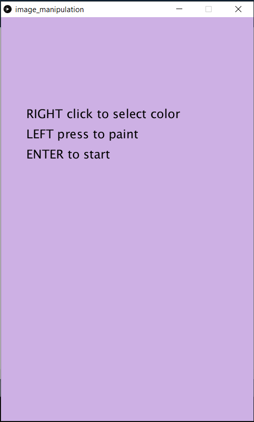
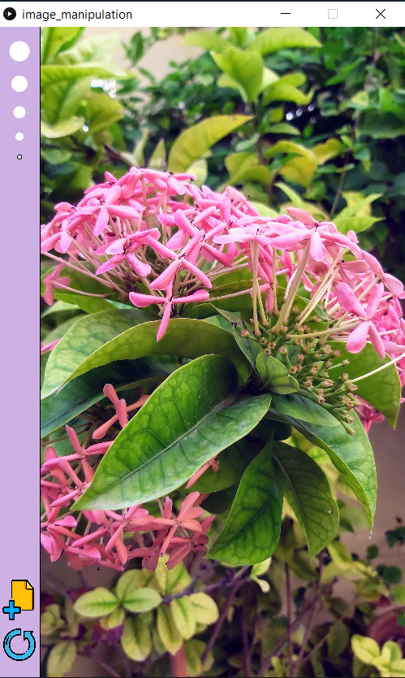
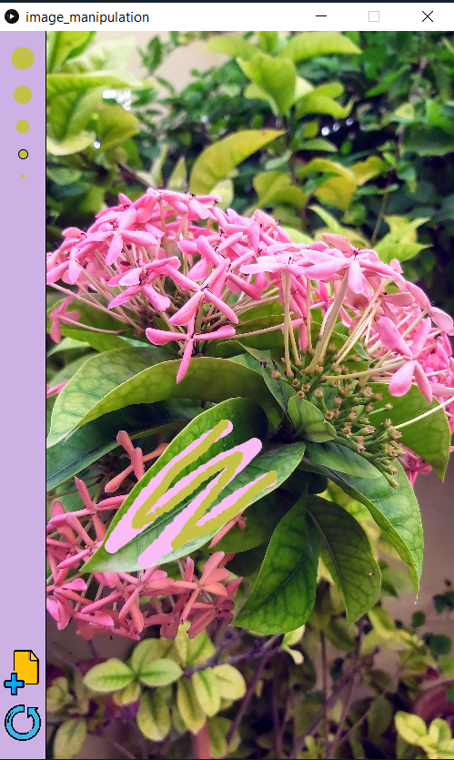

## Image Manipulation with Processing Assignment

**Overview:**
- In this project I have created a program that offers an image as, essentially, your canvas. The user can paint on the image using the color palette of the image itself.
- [Paletton](https://paletton.com) is used for the background color.
- The new image and reload icons are taken from [Smashicons](https://www.flaticon.com/authors/smashicons) and [Freepik](https://www.flaticon.com/authors/freepik) respectively, available on [Flaticon](https://www.flaticon.com/).

**The Code:**
- The initial screen is minimal, giving directions as to how to go about painting on the image.

- On pressing Enter, the program randomly displays one of the ten images.

- On the left is the toolbar, with five brush sizes and New and Reload buttons.
- The color of the brush options changes according to the color currently in use. The brush size being used is visibly selected on the toolbar.
- Right click on a pixel selects that color.
- Press left button and drag the mouse to paint.
- The reload button, reloads the current image so that it is free of all paint again.
- The new image button loads a different random image.

**Difficulties:**
- I wanted to paint in a way that the dragging mouse leaves a continuous trail of color. But I couldn't figure out how to do it and so settled on drawing a circulae ellipse at the mouse position. The problem with this is that when the mouse is dragged across quickly, the trail is broken up into separated circles.
- Drawing the five brush sizes with a single loop was slightly hard to figure out as separating them on the y-axis at regular intervals meant that the separation between consecutive sizes were irregular due to the difference in diameters.
- I spent a considerable amount of time at a point where my code was refusing to display the image and I couldn't figure out the reason behind it. Turns out it was a silly mistake in which I had forgotten to change the condition in for loop that increments the counter. Initially my loop was runnung backwards i.e. drawing the circles from biggest to smallest and so the counter was being decremented. Later, I changed it to draw from smallest to biggest (to make the y coordinate formula simpler) but forgot to switch the incrementation.

- Overall, I am quite happy with how the program turned out :)
