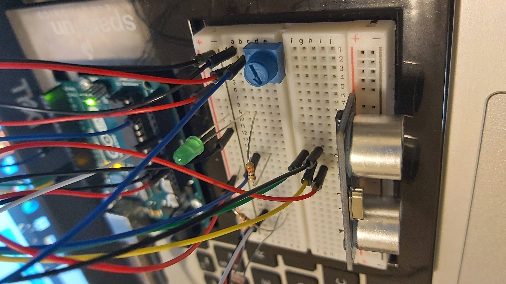

## Intro to IM Final Project

The premise of the game is to camouflage the character against the background. Processing sets the background color randomly and you have to replicate it using the three sensors that are mapped to the RGB values (R = distance sensor, G = potentiometer, B = photoresistor). When the character is succesfully camouflaged and happy, the green LED on the Arduino lights up to signal this and as the next background color appears it turns off again. You can choose to have the rgb values of the background visible on the screen. The free play mode is neverending, while in the timed mode you have 40 seconds per stageand if you don't manage to camouflage before the clock runs out you lose the game and the character dies.

### **Schematic:**

### **Picture:**

Links to videos of the game:  and 
