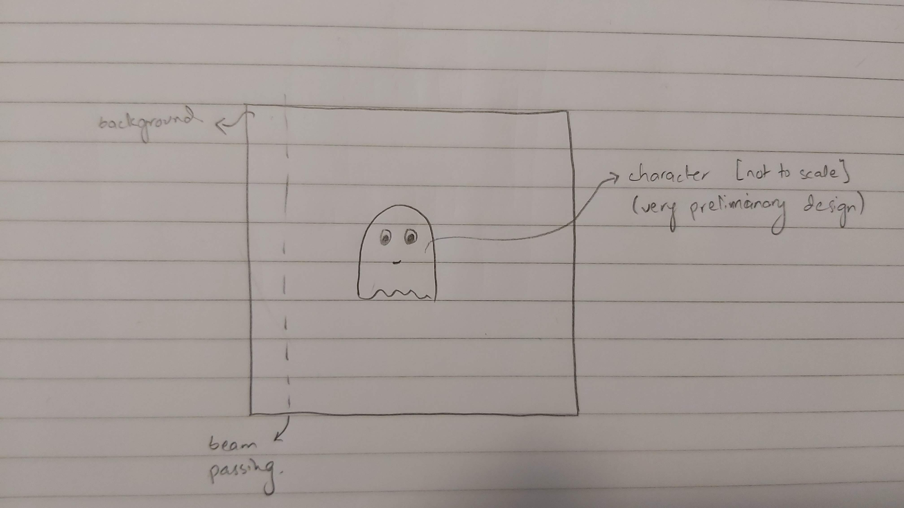

## Journal

I am planning on doing a color matching game. Basically, my processing video, upon starting the game will take up a random background color. The objective will be to match the color of the character to the background i.e. camouflage against the screen. In order to do this, the player will have to use Arduino. The Arduino will be equipped with a photoresistor, a potentiometer and a distance sensor. Each of these would have values mapped to 0-255 and will represent one of the RGB colors. The player will have to use the sensors to match the background. (Obviously there will be a margin of error so as to not make this impossible). To make this a litte more challenging, the character will have to dodge laser beams (or enemy or something) that can appear from any side of the screen at any point in axis to travel to the opposite end in a straight line. Arrow keys must be used to dodge. If the character is camouflaged, the beam will not hurt it, otherwise the game will be lost. When a color is successfully matched, a slight victory sound will play (either on the computer or the buzzer) and after a while the background will again change.

### 28 November:
I built the preliminary circuit today. A UV sensor, a potentiometer and a photoresistor.

### 4 December:
- Designed the character.
- Linked Arduino with Processing and tested values.
- Random background color selection.
- Color of character according to sensor data.

### 5 December:
- Made the start screen with a "Start" button.
- Added an option to make color values visible as it was getting very complicated.
- Added happy expression to character upon success.
- Decided to scrap the laser idea as it is already complicated enough.

### 9 December:
- Decided to make two game modes: Free play and timed.
- Changed start screen to show both options as well as game title.
- Made a "You Lost" screen with a "Back to menu" button.
- Changed to "Game Over" screen showing the dead character.
- Added an LED to Arduino to signal success as looking at the screen at every moment is not possible.
