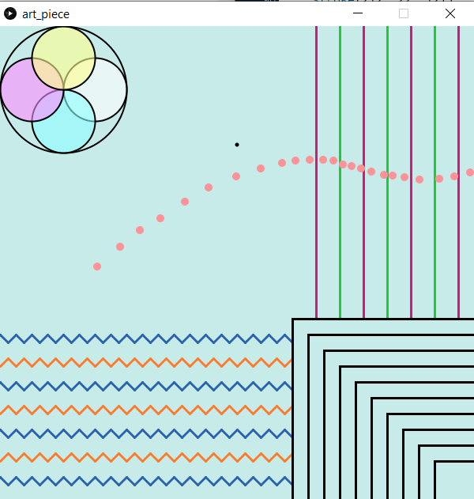

## Artwork with Processing Assignment

**Screenshot:** 

- This was really fun to do, and I'm sure if I had more time on my hands I could have done a much better job. Nevertheless, I am quite pleased wuth the final result.
- Since my art piece contains moving and changing parts so the screenshot doesn't really portray the most accurate picture.
- Once again, I used [Paletton](https://paletton.com/) to choose the color scheme.
- I had to change a few things from my original idea because they were too complicated to implement (or maybe I wasn't aware of a better approach).
