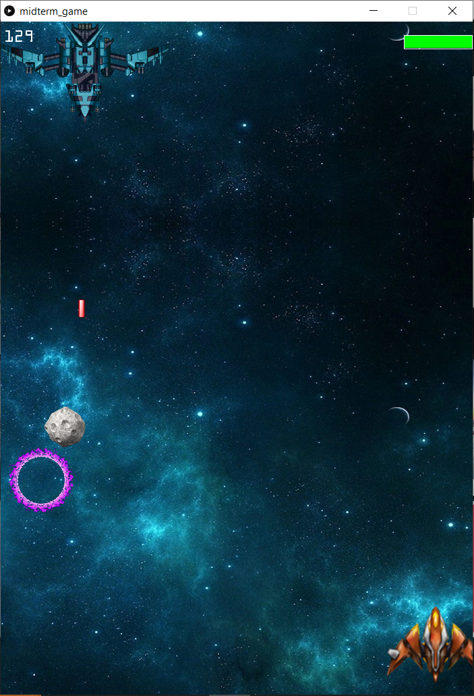
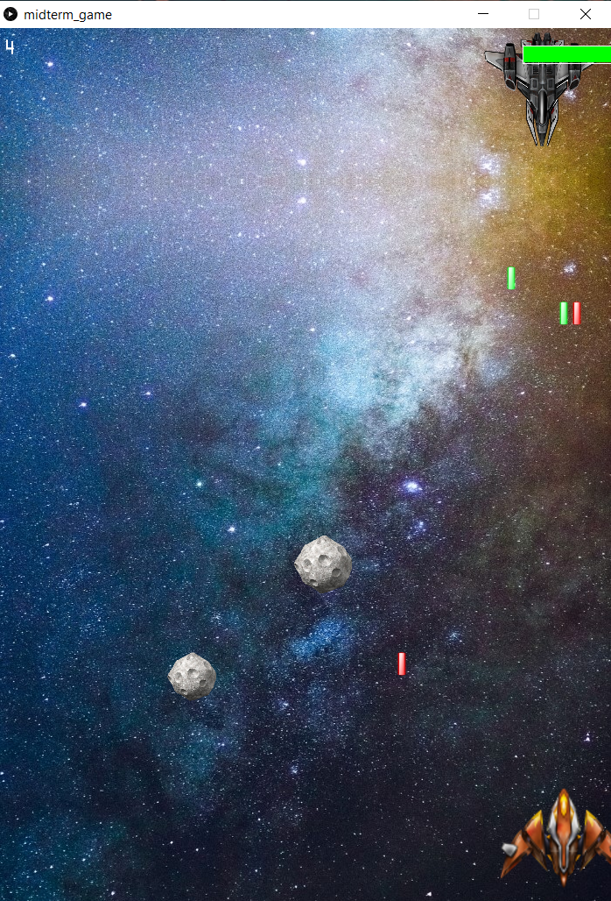

## Midterm Project with Processing: Space Wars

This is a space shooter game. When you run the program, the game logo appears on the window and then it transitions into the homescreen.

There are two buttons: PLAY and INSTRUCTIONS. The Instructions explain how the game works. There is a BACK button to go back to the homescreen.

The game starts with the user-controoled spaceship in the bottom-center of the screen. It can move sideways using the LEFT and RIGHT arrow keys. The UP key is used to shoot bullets. There is an enemy ship at the top of the screen shooting at regular intervals (these start ou big and become smaller). There is also an asteroid of random size, corresponding speed and random position moving downwards.The smaller the asteroid, the higher its speed.

There is a health bar displayed at top right. Initial health is 100. Each enemy bullet decreases it by 20 and each asteroid by 10. Enemy is killed (and a new one respawns) after being hit twice by player bullets. The position of the enemy is always random. There is a score counter at top left. It increases by 1 every 10 frames, by 10 when an enemy is killed and by 50 when a boss is killed. There are two powerups: bullet absorber that surrounds the ship and increases health by 10 whenever a bullet hits and a health booster that restores health.

Each stage has different background and music.

**Stage1:**
- 1 aasteroid at a time.
- 1 stationary enemy at a time.
- Stationary boss with uniform bullets

**Stage2:**
- 2 asteroids at a time.
- 1 moving enemy.
- Moving boss with uniform bullets

**Stage3:**
- 2 asteroids at a time.
- 2 moving enemies.
- Moving boss with splayed bullets.

The game is lost when health finishes.

It is won when the boss of the 3rd stage is killed.

Disclaimer: Since I couldn't win the game (I made it too hard lol), I called the gamewin screen on losing for the purpose of displaying in the screenshot.

### **The process:**

- This was the first time I used multiple tabs for my code and I wonder why I never did it before. Super convenient!
- The main problem I faced was coding the enemy bullets in such a way that they be independent of the enemy's position so as to continue on the same path even when the enemy moves. The bullet needed to have the initial x-coordinate according to where the enemy is loacted, but it had to run the length of the screen on that same coordinate and so could not be simply the same position as the enemy. My first thought was to use a dynamic 2d array and keep appending all the bullet positions to it, but then realized that it wasn't possible/really complicated to do with Java. After spending quite some time brainstorming and trying different things (and failing), I fiinally came up with the solution to use a 2d array of big enough size to be able to store the positions of all visible bullets at any given time. For any bullet that moved off-screen, its space in the array will become available again and the next bullet to be created will be stored in it.
- The bullets for the boss work on the same principle. The only difference being 2 different arrays for the x and y coordinates.
- I was initially using arrays for the positions of the powerups but that was making things a bit unnecessarily so I switched to 2 int variables for the coordinates of each of the 2 powerups, since two instances of the same powerup never appear at the same time.
- For the scrolling background, I was displaying the same picture again and again which created an inconsistency in the illusion of a movement. Therefore, I created a second image for every stage by flipping and inverting the first one. And then I displayed these two over and over.

Note: All my pictures are taken from Google.
